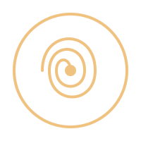

  

# ☀️ Kairos

**Time you observe, not time you obey.**

Kairos is a **living time system** — not a clock, but a companion.  
It anchors itself to what you see: the sun, the moon, the stars, the seasons.

It does not require GPS, internet, or a database.  
It trusts your eyes.

---

## What You See

When you open Kairos, you see:

`19:33 (293.4°) · ⛲Well · Harvest Moon 9 · ☀️Radiance · 4.54B / 2026.635`

This is not a timestamp. It is a **moment** — your moment.

| Element | Meaning |
|---------|---------|
| `19:33 (293.4°)` | **True solar time** (12:00 = solar noon) + the Sun's real **azimuth** in degrees — the number and the sky-dome bead always agree |
| `⛲Well` | The day — Sundial, Well, Root, Bloom, Forge, Harvest, or Star |
| `Harvest Moon 9` | The month and day — one of 13 moons, named for what is happening in the living world |
| `☀️Radiance` | The season — Emergence, Radiance, Release, or Stillness |
| `4.54B / 2026.635` | The year — Earth's age, unbroken, from the beginning of our world |

### The observation matrix (sky-dome)

The heart of the app is a living sky map: the **Sun and Moon are placed by
their real altitude and azimuth** on a circular **degree wheel** (0–360°
every 30°) with visible **altitude rings** (20/40/60/80°) — a bead at 60°
altitude floats near the zenith, and at 0° it sits exactly on the wheel edge.
A decorative **13-point natural ring** (360/13 = 27.69°) inside the wheel
echoes the 13 · 28 · 7 sequence — a separate scale, never a substitute for
the azimuth readout. An optional **virtual Earth** in the centre (⚙️
Configure → 🌍 Show Sun Light, off by default) shows the **Sun as a glowing
disc** that floods the space around it: a soft glow around the Sun bead, a
soft gradient wedge flooding to the Earth and the Earth's lit half; the
opacity maps day / twilight / night and it turns red during an eclipse.
Bodies below the horizon clamp to the wheel edge as dimmed **ghost beads**,
and at dusk/dawn a soft **twilight glow** fades in around the horizon
(civil −6…0°, nautical −12…−6°) with a **sunrise countdown** under the wheel
while the sun is below it. When the Sun and Moon align — during a real
eclipse — the beads overlap and the app lights up `🌑 ECLIPSE IN PROGRESS`.
No GPS required: Kairos reads your location from the browser, or you can set
it by hand in **⚙️ Configure → 📍 Your location**.

---

## How to Use Kairos

### 1. Observe the Sky
- Press **🌅 Sunrise** when the sun touches the horizon.
- Press **🌇 Sunset** when it disappears.
- Or, if you have a stick: press **⚖️ Shadow = Stick** when the shadow equals its length (morning and afternoon).
- Already have exact times (e.g. from suncalc.org)? Type them in under **"Or enter observed times"** in the ⚙️ Configure tab — sunrise + sunset (noon = their midpoint), or the **solar noon / culmination** directly. On the CLI: `kairos --noon 13:41`.

The system calculates your local solar noon from these observations.

### 2. Observe the Moon
- Tap the emoji that matches what you see: 🌑 🌒 🌓 🌔 🌕 🌖 🌗 🌘

### 3. Observe the Season
- Press the season that feels right: Spring · Summer · Autumn · Winter

### 4. Explore
- Click on any food, herb, or festival to see more.
- Add your own plants, traditions, and celebrations.
- Share your moment — with a photo, a date, and a place.

### 5. Choose your lens
- In **⚙️ Configure** pick a **📅 Calendar Lens** — which calendar the
  header shows: Kairos, Tartarian, Celtic, Chinese, Vedic or Mystical.
- Pick a **🌿 Energy Lens** — which tradition reinterprets the day's energy
  (archetype, moon mood, element, festival, in-season food): Curanderismo,
  Taoist, Vedic, Pagan/Wiccan, Mesopotamian, Egyptian, Mayan — or **None**
  for pure Kairos. Your choices are remembered on the device.
- Pick a **⏱️ Time System** — read the same sky through a 13-based clock
  (13 hours per day, 28 minutes per hour, 13 seconds per minute) or the
  **26-hour rhythm** — 13 light + 13 dark hours (26 hours per day,
  28 minutes per hour, 7 seconds per minute). Both count true solar time,
  so natural noon is solar noon and the header degree stays the Sun's
  azimuth — the number and the sky-dome bead still agree.

### 🌐 Languages
Kairos speaks seven languages — English (default), Dutch, Frisian, German,
French, Spanish and Chinese. The web app has a **Language** picker in the
⚙️ Configure tab; the CLI takes `--lang=nl` (or `de`, `fr`, `es`, `zh`, `fy`).
See [docs/I18N.md](docs/I18N.md) to add another language.

---

## Join the Community

Kairos is built for everyone — and by everyone.

- **Share your moment** — take a photo, add your Kairos date, and share it.
- **Add your knowledge** — contribute plants, traditions, and festivals from your region.
- **Observe together** — compare your observations with others.
- **Help us grow** — report bugs, suggest features, or just share your story.

Together, we can build a time system that is truly *of the people*.

See [docs/COMMUNITY.md](docs/COMMUNITY.md) for ways to take part, and
[docs/CONTRIBUTE.md](docs/CONTRIBUTE.md) to contribute code and data.

---

## Why This Matters

> *"Time is not a line. It is a spiral — and we are standing on it."*

Most calendars are inherited — built by empires, adjusted by popes, patched by politicians. They drift. They correct. They forget.

Kairos does not drift. It does not correct. It simply *observes*.

- **Observed** — you can see it in the sky, the soil, the stars.
- **Verifiable** — you can check it against your own eyes.
- **Humble** — it does not claim to be the final word.
- **Open** — you can adjust it, rename it, make it your own.

---

## What You Can Do With It

| Use | How |
|-----|-----|
| **Live your day** | Let the rhythm of the day guide your work, rest, and connection |
| **Plan your meals** | Eat what is in season — see the full chemical inventory of any plant |
| **Celebrate** | Mark festivals, rituals, and moments that matter to you |
| **Share** | Capture your moment — with a photo, a date, and a place — and share it |
| **Wear it** | Put the Kairos clock on your wrist — the standalone watch face (`web/watch.html`) shows only the solar time |
| **Observe** | Check the checksum — the system shows you its assumptions, its sources, its limits |

---

## The Philosophy, In Brief

> *"Kairos does not measure time. It invites you to observe it."*

We are not building a monument.  
We are building a *mirror*.

- **Honesty** — we show our sources, our errors, our assumptions
- **Transparency** — you can see how the system works, and why
- **Empowerment** — you choose your time, your food, your reality
- **Connection** — you are part of a larger rhythm, not separate from it

---

## Get Started

1. Open Kairos on your phone or desktop.
2. Observe the sky — press the buttons that match what you see.
3. Explore the layers — time, food, festivals, archetypes.
4. Make it yours — add your own plants, traditions, and celebrations.
5. Share your moment — with a photo, a date, and a place.

---

## Mood Images

Open-source, free-to-use photography (via [Unsplash](https://unsplash.com)) used for mood:

| Theme | Photo | Credit |
|-------|-------|--------|
| ☀️ Sunlight through trees | [View on Unsplash](https://unsplash.com/s/photos/sunlight-through-trees) | Jörg Angeli |
| 🌙 Moon at night | [View on Unsplash](https://unsplash.com/s/photos/moon-at-night) | Diana Simumpande |
| 🌾 Harvest field | [View on Unsplash](https://unsplash.com/s/photos/harvest-field) | Chris Leipelt |
| ❄️ Winter forest | [View on Unsplash](https://unsplash.com/s/photos/winter-forest) | Anton Darius |
| 🌸 Spring blossoms | [View on Unsplash](https://unsplash.com/s/photos/spring-blossoms) | Cristina Gottardi |
| 🤝 Community hands | [View on Unsplash](https://unsplash.com/s/photos/community-hands) | Helena Lopes |

> These link to the matching Unsplash searches; swap in the direct photo URLs when you have them.

---

## License & Source

Kairos is open source, free, and forever.

- **Source**: [GitHub](https://github.com/jbstoker/kairos)
- **License**: GPLv3 (or your choice)
- **Philosophy**: [Constitution](CONSTITUTION.md)

---

> *"Time you observe, not time you obey."*

— This is Kairos.
